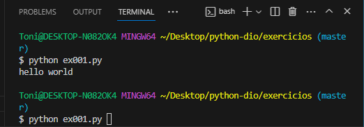
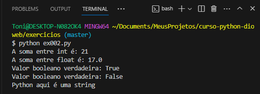

# Python na dio

## Visão Geral

- Linguagem amigal e intuitiva
- Código aberto
- Código tão inteligível quanto o inglês
- Adequada para tarefas diárias e produtiva
- Lançada em 1991 a versão 0.9.0
- Em 2000 na sua segunda versão nasce list comprehensions e a melhoria feita no coletor de lixo
- Em 2001 nasce a PSF que contem toda a documentação
- Em 2008 nasce a versão 3.0 que vem com uma melhora brutal na performance

## Onde devo utilizar o Python

- Tipagem dinâmica e forte
- Multiplataforma e multiparadigma
- Comunidade gigante e ativa
- Curva de aprendizado baixa
- Não é forte em desenvolvimento mobile

## Programar é uma receita

- Programar consiste no ato de informar o computador uma sequência de passos que devem ser processadas
- Arquivo em python tem extensão py

## Primeiros passos em Python

- O padrão Hello World

```bash
    print('Hello World')
```

- Para exibir no terminal só é ir até o local do aquivo atraves do cd e digitar python nome do arquivo(ex001.py) no meu caso, é bom sempre olhar com ls onde estamos localizado e em seguida usar o cd para mover entre as pastas.



## Tipos em python

- Serve para definir caracteristicas e comportamentos de um valor (objeto) para o interpretador:
- Texto = str
- Númerico = int, float, complex
- Sequência = list, tuple, range > array
- Mapa = dict > chave:valor > nome:lemos
- Coleção = set, fronzenset > parecido com array
- Booleano = bool > true e false
- Binário = bytes, bytearray, memoryview



## Modo interativo, funções dir e help em python

- O interpretador do Python pode exercutar em modo que permite ao desenvolvedor escrever e ver o resultado na hora
- Colocando (python) no terminal ou executando o scipt com a flag -i(python -i app.py) para sair escrevo exit()
- Dir sem argumentos dir() e com argumentos dir(100), retorna a lista de nomes dos metodos que podemos exercutar no escopo local atual
- Help sem argumentos help() e com argumentos help(100), vai falar quais são os argumentos que o metodo recebe, o que ele retorna e como funciona
- Dir e Help são basicamente uma documentação offline

## Variáveis e constantes em python

- Variáveis

```bash
    age = 18
    name = 'Silva'
    print(f'Meu nome é {name} e eu tenho {age} ano(s) de idade.')
    // Meu nome é Silva e eu tenho 18 ano(s) de idade.
```

```bash
    age2, name2 = (18, 'Silva')
    print(f'Meu nome é {name2} e eu tenho {age2} ano(s) de idade.')
    // Meu nome é Silva e eu tenho 18 ano(s) de idade.
```

- Variáveis: alterando valores em python precisamos declarar as variáveis por que é dessa forma que ele consegue indentificar os tipos delas e para substituir só é atribuir um novo valor

```bash
    age = 25
    name = 'Lemos'
    print(f'Meu nome é {name} e eu tenho {age} ano(s) de idade.')
    // Meu nome é Lemos e eu tenho 25 ano(s) de idade.
```

```bash
    age2, name2 = (21, 'Maria')
    print(f'Meu nome é {name2} e eu tenho {age2} ano(s) de idade.')
    // Meu nome é Maria e eu tenho 21 ano(s) de idade.
```

- Constantes: em python não tem palavra reservada para constantes igual em javascript que colocamos, const nome = 'Silva' por exemplo, em python usamos uma convenção escrevendo a variável toda em maíuscula NOME = 'Lemos'

- Boas práticas: em python é bom escrever em snake case ESTADOS_BRASILEIROS, NOME_COMPLETO, limite_saque_diario e sobre constantes o interpretador não consegue bloquear a alteração de uma 'constante'

## Convertendo tipos em python

- Inteiro para float

```bash
    preco = 10
    print(preco)
    // 10

    preco = float(preco)
    print(preco)
    // 10.0

    preco = 10 / 2
    print(preco)
    // 5.0
```

- Float para inteiro

```bash
    preco = 10.30
    print(preco)
    // 10.3

    preco = int(preco)
    print(preco)
    // 10
```

- Conversão por divisão com // o numero int é preservado como inteiro, com apenas / o numero int é transformado em float

```bash
    preco = 10
    print(preco)
    // 10

    print(preco / 2)
    // 5.0

    print(preco // 2)
    // 5
```

- Número para string

```bash
    preco = 10.50
    idade = 19

    print(str(preco))
    // 10.5

    print(str(idade))
    // 19

    texto = f"idade {idade} preco {preco}"
    print(texto)
    // idade 19 preco 10.5
```

- String para número

```bash
    preco = "10.50"
    idade = "19"

    print(float(preco))
    // 10.5

    print(int(idade))
    // 19
```

- Erro de conversão

```bash
    preco = "python"
    print(float(preco))

    Traceback (most recent call last):
    File "C:\Users\Toni\Documents\MeusProjetos\curso-python-dioweb\exercicios\ex004.py", line 34, in <module>
    print(float(preco))
    ValueError: could not convert string to float: 'python'
```

## Funções de entrada e saída em python

- Função builtin input é utilizada para ler dados de entrada(teclado) basicamente fazer uma interação com o usuário

- Função print é utilizada para exibir dados de saída(tela), posso atribuir argumentos opcionais (sep, end, file e flush) todos são convertidos para string e é exibida para o usário

```bash
    nome = input("Informe o seu nome abaixo: \n")
    print('Seu nome é', nome, end="...\n")
    print('Seu nome é', nome, sep="#")
    // Informe o seu nome abaixo:
    // Silva
    // Seu nome é Silva...
    // Seu nome é#Silva
```

## Operadores artiméticos em python

```bash
# Adição
print(1 + 1)
# 2

# Subtração
print(10 - 5)
# 5

# Multiplicação
print(10 * 5)
# 50

# Divisão
print(10 / 2)
# 5.0

# Divisão inteira
print(10 // 2)
# 5

# Módulo
print(10 % 3)
# 1

# Exponenciação
print(2 ** 3)
# 8
```

## Operadores de comparação em python

```bash
saldo = 450
saque = 200
print(saldo == saque)
# == igual
# false
print(saldo != saque)
# != diferente
#true
print(saldo >= saque)
# >= maior ou igual
#true
print(saldo <= saque)
#<= menor ou igual
#false
```

## Operadores de atribuição em python

```bash
saldo = 500
print(saldo)
# = atribuir
# 500
# saldo += 200
# print(saldo)
# saldo = saldo + 200
# 700
saldo -= 100
print(saldo)
# saldo = saldo - 100
# 400
```

## Operadores Lógicos em python

```bash
saldo = 1000
saque = 200
limite = 100
print(saldo >= saque and saque <= limite)
# True and False = False
# False
# Operador and em python, similar/igual ao && em js
```

```bash
saldo = 1000
saque = 200
limite = 100
print(saldo >= saque or saque <= limite)
# True and False = True
# True
# Operador or em python, similar/igual ao || em js
```

```bash
saldo = 1000
saque = 200
limite = 100
print(not saldo >= saque)
# A negação de True é False
# False
# Operador not em python, similar/igual ! em js
```

## Operadores de identidade em python

```bash
a = [1, 2, 3]
b = [1, 2, 3]

print(a is b) # ocupa o mesmo espaço na mémoria ? False
print(a is not b) # não ocupa o mesmo espaço na mémoria ? True
```

```bash
curso = 'curso em python'
curso_python = curso

print(curso is curso_python) # ocupa o mesmo espaço na mémoria ? True
print(curso is not curso_python) # não ocupa o mesmo espaço na mémoria ? False
```

## Operador de associação em python

```bash
curso = "Curso de Python"
frutas = ["Maçã", "Uva", "Pera"]
saques = [1500, 500]

print("Python" in curso)
# "Python" está dentro da variável curso = True
# True
print("Laranja" not in frutas)
# "Laranja" não está dentro do array frutas = True
# True
print(200 in saques)
# 200 está dentro do array saques = False
# False
```

## Identação e blocos em python

- Em python identar alem de manter o código legível e manutenível ele também exerce um papel importante de definir onde um bloco de comando inicia e onde ele termina em javascript seria {} para delimitar inicio/fim de um bloco, em python não tem, ele tem apenas : para definir o inicio do bloco
- Em python utilizamos uma convenção de 4 espaçoes em branco para identar um bloco

```bash
def sacar(valor):
    saldo = 500

    if saldo >= valor:
        print("Valor sacado!")
        print("Retire o dinheiro na boca do caixa!")

    print("Obrigado por ser nosso cliente tenha um bom dia!")

sacar(500)
# Valor sacado!
# Retire o dinheiro na boca do caixa!
# Obrigado por ser nosso cliente tenha um bom dia!
```

## Estruturas condicionais em python

```bash
saldo = 2000.0
saque = float(input("Informe o valor do saque: "))

if saldo >= saque:
    print("Realizando saque!")

if saldo < saque:
    print("Saldo insuficiente!")
# if se o saque for maior exibir Realizando saque!
# if se o saque for menor exibir Saldo insuficiente!
```

```bash
saldo = 2000.0
saque = float(input("Informe o valor do saque: "))

if saldo >= saque:
    print("Realizando saque!")
else:
    print("Saldo insuficiente!")
# if se o saque for maior exibir Realizando saque!
# else se o saque não for maior exibir Saldo insuficiente!
```

```bash
opcao = int(input("Informe uma opção: \n[1] Sacar\n[2] Extrato\n"))

if opcao == 1:
    valor = float(input("Informe a quantia para o saque: "))
elif opcao == 2:
    print("Exibindo o extrato...")
else:
    exit("Opção inválida")
# if se opcao for igual a 1 pedimos a quantia que será sacada
# elif se não, se igual a 2 exiba o extrato
# else se não opção inválida
```

## if aninhado em python

```bash
conta_normal = True
conta_universidade = False

saldo = 2000
saque = 2500
cheque_especial = 450

if conta_normal:
    if saldo >= saque:
        print("Saque realizado com sucesso!")
    elif saque <= (saldo + cheque_especial):
        print("Saque realizado com uso do cheque especial!")
    else:
        print("Saldo insuficiente!")
elif conta_universidade:
    if saldo >= saque:
        print("Saque realizado com sucesso!")
    else:
        print("Saldo insuficiente")
else:
    print("Sistema não reconhece essa opção, entre em contato com o banco")
```

## If ternário em python

```bash
saldo = 500
saque = 500

status = "Sucesso" if saldo >= saque else "Falha"
print(f"{status} ao realizar o saque!")
# Sucesso ao realizar o saque!
```

## Estrutura de repetição em python

```bash
texto = input("Informe um texto: ")
VOGAIS = "AEIOU"

for letra in texto:
    if letra.upper() in VOGAIS:
        print(letra, end="")
print()
# python
# o
# Geralmente utilizamos o for quando temos um valor predeterminado
```

## Função range com for no python

```bash
for numero in range(0, 11):
    print(numero, end=" ")
# 0 1 2 3 4 5 6 7 8 9 10
# Geralmente utilizamos o for quando temos um valor predeterminado
```

```bash
# Tabuada do 5
for numero in range(0, 51, 5):
    print(numero, end=" ")
# 0 5 10 15 20 25 30 35 40 45 50
# Geralmente utilizamos o for quando temos um valor predeterminado
```

## While em python

```bash
opcao = -1

while opcao != 0:
    opcao = int(input("[1] Sacar \n[2] Extrato \n[0] Sair \n: "))

    if opcao == 1:
        print("Sacando...")
    elif opcao == 2:
        print("Exibir o extrato...")

print("Obrigado por utilizar nosso Sistema")
# Geralmente utilizamos o while quando não temos um valor predeterminado
```

```bash
while True:
    opcao = int(input("[1] Sacar \n[2] Extrato \n[0] Sair \n: "))

    if opcao == 1:
        print("Sacando...")
    elif opcao == 2:
        print("Exibir o extrato...")
    elif opcao == 0:
        break

print("Obrigado por utilizar nosso Sistema")
# Bem parecido com o outro exemplo só que contem o break
# Geralmente o break é utilizado em um loop infinito como no exemplo acima
```

## Métodos úteis da classe string em python

- Maiúscula, minúscula e título

```bash
curso = "pytHOn"

print(curso.upper())
# PYTHON > similar em js ao uppercase
print(curso.lower())
# PYTHON
print(curso.title())
# PYTHON
```

- Eliminando espaços em branco

```bash
curso = "  Python  "

print(curso.strip())
# Python
print(curso.lstrip())
# Python  "
print(curso.rstrip())
# "  Python
```

- Junções e centralização

```bash
curso = "Python"

print(curso.center(10, "#"))
# ##Python##

print(".".join(curso))
# "P.y.t.h.o.n"
```

## Interpolação de variáveis

- Old style %

```bash
nome = "Lemos"
idade = 22
profissao = "Programador"
linguagem = "Python"

print("Olá, me chamo %s. Eu tenho %d anos de idade, trabalho como %s e estou matriculado no curso de %s." % (nome, idade, profissao, linguagem))
#Olá, me chamo Lemos. Eu tenho 22 anos de idade, trabalho como Programador e estou matriculado no curso de Python.
```

- Método format

```bash
nome = "Lemos"
idade = 22
profissao = "Programador"
linguagem = "Python"

print("Olá, me chamo {}. Eu tenho {} anos de idade, trabalho como {} e estou matriculado no curso de {}.".format(nome, idade, profissao, linguagem))
#Olá, me chamo Lemos. Eu tenho 22 anos de idade, trabalho como Programador e estou matriculado no curso de Python.
```

- Método format

```bash
nome = "Lemos"
idade = 22
profissao = "Programador"
linguagem = "Python"

print("Olá, me chamo {0}. Eu tenho {1} anos de idade, trabalho como {2} e estou matriculado no curso de {3}.".format(nome, idade, profissao, linguagem))
#Olá, me chamo Lemos. Eu tenho 22 anos de idade, trabalho como Programador e estou matriculado no curso de Python.

print("Olá, me chamo {nome}. Eu tenho {idade} anos de idade, trabalho como {profissao} e estou matriculado no curso de {linguagem}.".format(nome=nome, idade=idade, profissao=profissao, linguagem=linguagem))
#Olá, me chamo Lemos. Eu tenho 22 anos de idade, trabalho como Programador e estou matriculado no curso de Python.
```

- f-string

```bash
# parace muito com tamplate string do js
nome = "Lemos"
idade = 22
profissao = "Programador"
linguagem = "Python"

print(f"Olá, me chamo {nome}. Eu tenho {idade} anos de idade, trabalho como {profissao} e estou matriculado no curso de {linguagem}.")
#Olá, me chamo Lemos. Eu tenho 22 anos de idade, trabalho como Programador e estou matriculado no curso de Python.
```

- Formatando strings com f-string

```bash
PI = 3.14159

print(f"Valor de PI: {PI:.2f}")
# Valor de PI: 3.14

print(f"Valor de PI: {PI:10.2f}")
# Valor de PI:       3.14
```

- Fatiamento de string

```bash
#[inicio:pausa:passo]
nome = "Lemos da Silva"

print(nome[0])
#L
print(nome[0:5])
#Lemos
print(nome[:13:2])
#Lmsd iv
```

- String múltiplas linhas | String triplas

```bash
nome = "Lemos"

print(f"""Olá {nome},
seja bem vindo!""")
# Olá Lemos,
# seja bem vindo!
```

- Desafio de um sistema bancário com python

```bash

menu = """

[0] Depositar
[1] Sacar
[2] Extrato
[3] Sair

=> """

saldo = 0
limite = 500
extrato = ""
numero_saques = 0
LIMITE_SAQUES = 3

while True:

    opcao = input(menu)

    if opcao == "0":

        deposito = float(input("Informe um valor para depôsitar R$"))
        print(f"Valor de R${deposito:.2f} depôsitado!" if deposito > 0 else "Valor inválido!")
        extrato += f"Depôsito: R${deposito:.2f}\n"
        saldo += deposito

    elif opcao == "1":

        if saldo <= 0:
            print(f"Você não tem Saldo... \nSaldo atual R${saldo:.2f}")
            continue

        if numero_saques == LIMITE_SAQUES:
            print("Limite de saques excedidos")
            continue

        saque = float(input("Informe um valor para sacar R$"))
        if saque > limite or saque <= 0:
            print(f"Valor inválido")
            continue

        else:
            print(f"Valor sacado R${saque}")
        extrato += f"Saque: R${saque:.2f}\n"
        saldo -= saque
        numero_saques += 1

    elif opcao == "2":
        if not extrato:
            print('Não há extrato atualmente')
        else:
            print(extrato)
            print(f'Atualmente seu saldo é: R${saldo:.2f}')

    elif opcao == "3":
        break

    else:
        print("Digite uma opção válida!")

```

## Trabalhando com listas em python

- Listas Criação e acesso aos dados

```bash
# Forma que será encontrada na maioria das vezes
frutas = ["Laranja", "Maçã", "Uva"]
frutas[0]
# Laranja

# Lista vazia
frutas = []

# Método construtor list
letras = list("python")

numeros = list(range(10))

carro = ["Ferrari", "F8", 4200000, 2020, 2900, "Recife", True]
```

- Matriz

```bash
# lista bidimensional(tabelas)
matriz = [
    [1, "a", 2],
    [3, 4, "f"],
    ["o", 5, 2]
]

print(matriz[0][1])
# a
print(matriz[1][0])
# 3
print(matriz[2][2])
# 2
```

- Fatiamento

```bash

lista = ['p', 'y', 't', 'h', 'o', 'n']

lista[0:3:2]
# ['p', 't']
lista[::]
# ['p', 'y', 't', 'h', 'o', 'n']
```

- Iterar listas

```bash

carros = ["gol", "celta", "palio"]

for carro in carros:
    print(carro)
# gol
# celta
# palio
```

- Função enumerate

```bash

for indice, carro in enumerate(carros):
    print(f"{indice} : {carro}")
# 0 : gol
# 1 : celta
# 2 : palio

```

- Compreensão de listas

```bash
# Filtro versao 1
numeros = [1, 2, 3, 4, 5, 6, 7, 8]
pares = []
for numero in numeros:
    if numero % 2 == 0:
        pares.append(numero)
        # append é parecido/igual com o push do js
        # [2, 4, 6, 8]

# Filtro versao 2
numeros = [1, 2, 3, 4, 5, 6, 7, 8]
pares = [numero for numero in numeros if numero % == 0]
# [2, 4, 6, 8]
```

- Métodos da classe list

```bash

lista = []
lista.append(2)
lista.append("String")
lista.append(["array", "?", "muito", "parecido", "!"])
# [2, 'String', ['array', '?', 'muito', 'parecido', '!']]

lista.clear()
# limpar lista
# []

[].copy
# forma de garantir uma copia

[].count
# forma de contar os objetos dentro da lista

[].extend
# forma de juntar as listas

["objeto"].index
# saber a posição do "objeto"

[].pop
# algo legal das listas é que elas vem organizadas como uma pilha
# pilha conceito = geralmente a ultima adição é a primeira a ser retirada
# podemos passar uma referência no pop

[].remove
# diferente do pop passamos o objeto e não a referência

[].reverse
# colocar a lista ao contrario parecido com o -1 usado anteriormente

[].sort
# sorteia(ordena) a lista
# podemos passar tipos de ordenamento por string por reverse
# pode passar a key e o reverse

lista = [0, 1, 2, 3, 4]
len(lista)
# 5
# bem parecido com o length do js

lista = [0, 1, 2, 3, 4]
sorted(lista)
# serve também para ordenar uma lista
# pode passar a key e o reverse

```

## Tuplas

- Irmã da lista

```bash
# tupla é bem mais restrita
# tupla é imutável
# por uma virgula no final é uma boa pratica para não da bronca do interpretador o qual pode confundir uma tupla com uma precedência
frutas = ("laranja", "pera", "uva",)
frutas[0] # laranja

letras = tuple("python")
numeros = tuple([1, 2, 3, 4])
pais = ("Brasil",)
```

- Tuplhas aninhadas

```bash
# observar os parênteses
matriz = (
    (1, "a", 2),
    (3, 4, "f"),
    ("o", 5, 2),
)

print(matriz[0][1])
# a
print(matriz[1][0])
# 3
print(matriz[2][2])
# 2
```

- fatiamento igual ao de listas inicio:final:elementos pulados
- ao tentar atribuir valores a tupla ela irá retornar um erro TypeError: 'tuple' does not item assignment
- iterar também é igual a lista
- principal diferença, tem bem menos métodos
- ().count | ().index | len() | apenas esses métodos

## Conjuntos em python

- Um set é uma coleção que não possui objetos repetidos,
  usamos sets para representar conjuntos matemáticos ou eliminar itens duplicados de um iterável
- Conjuntos (set) em python não suportam indexação caso for preciso acessar precisamos converter o set para lista
- O massa do set | conjunto é que podemos fazer todas as operações que fazemos na matemática

```bash
listaNum = set([1, 1, 2, 2, 3, 4, 5])
print(listaNum)
# {1, 2, 3, 4, 5}
# o set não garante a ordem
tupla_de_carros = set(("palio", "gol", "gol", "celta", "palio",))
print(tupla_de_carros)
# {"palio", "gol", "celta"} # cuidado aqui ele retornou sempre alterando a orgem

numeros = {1, 2, 3, 4, 5} # set | conjunto
numeros = list(numeros)
numeros[0]
# 1
for numero in numeros:
    print(numero)
# 1 2 3 4 5

carros = {"gol", "palio", "celta"}
for indice, carro in enumerate(carros):
    print(f"{indice} : {carro}")
# 0 : celta 1 : gol 2 : palio

conjunto_a = {1, 2, 3}
conjunto_b = {2, 3, 4}

print(conjunto_a.union(conjunto_b))
# {}.union
# {1, 2, 3, 4}
print(conjunto_a.intersection(conjunto_b))
# {}.intersection
# {2, 3}
print(conjunto_a.difference(conjunto_b))
# {1}
print(conjunto_b.difference(conjunto_a))
# {4}
print(conjunto_a.symmetric_difference(conjunto_b))
# {1, 4}

sorteio = {1, 23, 24}
sorteio.add(5)
print(sorteio)
# {24, 1, 5, 23}

sorteio.copy()
print(sorteio)
# {24, 1, 5, 23}

sorteio.discard(1)
print(sorteio)
# {24, 5, 23}

sorteio.pop()
print(sorteio)
# {5, 23}

sorteio.remove(23)
print(sorteio)
# {5}

print(1 in sorteio)
# False

print(len(sorteio))
# 1

sorteio.clear()
print(sorteio)
# set()

```

## Dicionário

- Um dicionário é um conjunto não-ordenado de pares chave:valor, onde as chaves são únicas em uma dada instância do dicionário. Dicionários são delimitados por chaves: {}, e contém uma lista de pares chaves:valor separa por vírgulas.

```bash

pessoa = {"nome": "Gui", "idade":28}
# ambos os códigos são equivalentes
pessoa = dict(nome="Gui", idade=28)

nome = pessoa["nome"]
print(nome) # Gui

```

- Dicionários aninhados

```bash

contatos = {
    "gui@email.com": {"nome": "Gui", "telefone": "3333-3333"},
    "silva@email.com": {"nome": "Silva", "telefone": "3344-3333"},
    "marques@email.com": {"nome": "Marques", "telefone": "3355-3333"},
}

telefone = contatos["silva@email.com"]["telefone"]
print(telefone) # 3344-3333

```
